<div align="center">

# 📚 Library Management System

### *A Spring Boot CRUD application with One-to-Many JPA relationships, JPQL inner-join reporting, and a JSP UI.*

[](https://spring.io/projects/spring-boot)
[](https://openjdk.org/projects/jdk/17/)
[](https://maven.apache.org/)
[](https://spring.io/projects/spring-data-jpa)
[](https://www.h2database.com/)
[](#)
[](#section-4--testing)

</div>

> **Course:** SGA Assignment 2 &middot; Database and Application Development
> **Student:** Mohit Kumar &middot; **Roll No.:** 2024eb02256
> **Submitted:** May 2026

---

## ✨ At a glance

A small, complete Spring Boot project that manages two related entities — **Authors** and **Books** — with a clean MVC layering (controller → service → repository), Bean Validation, global exception handling, and a styled JSP front end. The H2 in-memory database is auto-seeded with 10 authors and 10 books on first run, so the app is interactive the moment it boots.

```bash
git clone https://github.com/mohit-1710/spring-boot-library-management.git
cd spring-boot-library-management/library-management
mvn spring-boot:run        # → http://localhost:8081/
mvn test                   # 37 tests, all passing
```

---

## 🧭 Table of contents

1. [Project overview](#section-1--project-overview)
2. [Entity-relationship design](#section-2--entity-relationship-design)
3. [Implementation details](#section-3--implementation-details)
4. [Testing](#section-4--testing)
5. [Challenges & solutions](#section-5--challenges--solutions)
6. [Dashboard](#section-6--dashboard)
7. [GitHub repository](#section-7--github-repository)

---

## SECTION 1 — Project overview

This project implements a **Library Management System** using Spring Boot, Spring Data JPA, and JSP. The system manages two core entities — **Author** and **Book** — linked via a One-to-Many relationship.

The application supports full **CRUD** (Create, Read, Update) operations through a web interface and uses an **H2 in-memory database** pre-loaded with sample records for immediate testing.

### Technology stack

| Layer        | Choice                              |
| ------------ | ----------------------------------- |
| Backend      | Spring Boot 2.7.18                  |
| Persistence  | Spring Data JPA (Hibernate)         |
| Database     | H2 In-Memory                        |
| Frontend     | Spring MVC + JSP / JSTL             |
| Validation   | Bean Validation (`javax.validation`) |
| Testing      | JUnit 5 + Mockito                   |
| Build tool   | Maven                               |

**Access URL:** `http://localhost:8081/`

---

## SECTION 2 — Entity-relationship design

### 2.1 Entities chosen

- **Author** — represents a book author.
- **Book** — represents a book belonging to a specific author.

### 2.2 Attributes

| Entity     | Attribute         | Type          | Constraints                |
| ---------- | ----------------- | ------------- | -------------------------- |
| **Author** | `id`              | BIGINT        | Primary Key (Auto)         |
|            | `name`            | VARCHAR(100)  | Not Null                   |
|            | `email`           | VARCHAR(150)  | Not Null, Unique           |
|            | `birthYear`       | INTEGER       |                            |
|            | `nationality`     | VARCHAR(50)   | Not Null                   |
| **Book**   | `id`              | BIGINT        | Primary Key (Auto)         |
|            | `title`           | VARCHAR(200)  | Not Null                   |
|            | `isbn`            | VARCHAR(20)   | Not Null, Unique           |
|            | `publicationYear` | INTEGER       | Not Null                   |
|            | `genre`           | VARCHAR(50)   | Not Null                   |
|            | `author_id`       | BIGINT        | Foreign Key → authors(id)  |

### 2.3 Relationship

**Author ──< Book (One-to-Many)**

- One Author can write many Books.
- Each Book must belong to exactly one Author.

**JPA Implementation:**

- **Author side:** `@OneToMany(mappedBy = "author", cascade = CascadeType.ALL, fetch = FetchType.LAZY)`
- **Book side:** `@ManyToOne(fetch = FetchType.EAGER)` and `@JoinColumn(name = "author_id", nullable = false)`

#### 📷 Screenshot 1 — ER Diagram

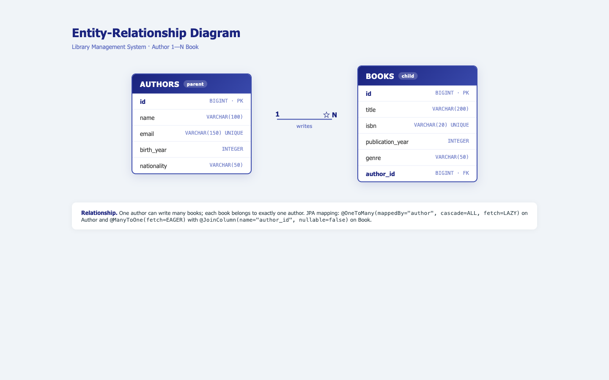

---

## SECTION 3 — Implementation details

### 3.1 Project structure

```
src/
├── main/
│   ├── java/com/library/
│   │   ├── LibraryManagementApplication.java   ← Entry Point
│   │   ├── config/DataLoader.java              ← Seeds 10 rows/table
│   │   ├── entity/ (Author.java, Book.java)
│   │   ├── dto/BookWithAuthorDTO.java          ← Join Projection
│   │   ├── repository/ (AuthorRepository.java, BookRepository.java)
│   │   ├── service/ (Interfaces & Implementations)
│   │   ├── controller/ (Home, Author, Book Controllers)
│   │   └── exception/ (Global Error Handling)
│   ├── resources/application.properties
│   └── webapp/
│       ├── css/style.css
│       └── WEB-INF/views/
│           ├── authors/ (list, add, edit.jsp)
│           └── books/ (list, add, edit, report.jsp)
└── test/ (Unit & Service Layer Tests)
```

### 3.2 Database population

The `DataLoader` class implements `CommandLineRunner` to automatically seed 10 Authors and 10 Books upon startup if the database is empty.

```java
@Component
public class DataLoader implements CommandLineRunner {
    @Override
    public void run(String... args) {
        if (authorRepository.count() > 0) return;

        Author a1 = authorRepository.save(new Author("J.K. Rowling", "jk.rowling@example.com", 1965, "British"));
        // ... (Seeding continues)

        bookRepository.saveAll(List.of(
            new Book("Harry Potter", "9780439708180", 1997, "Fantasy", a1)
        ));
    }
}
```

#### 📷 Screenshot 2 — H2 Console (`SELECT * FROM AUTHORS;` and `SELECT * FROM BOOKS;`)

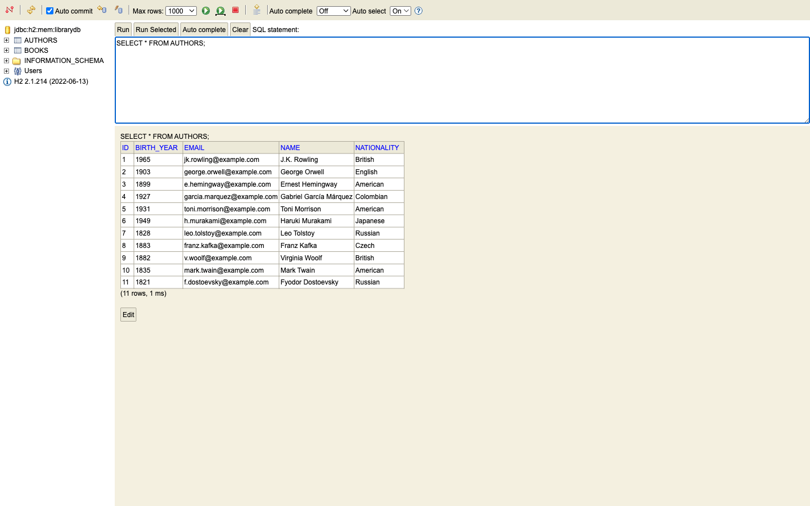
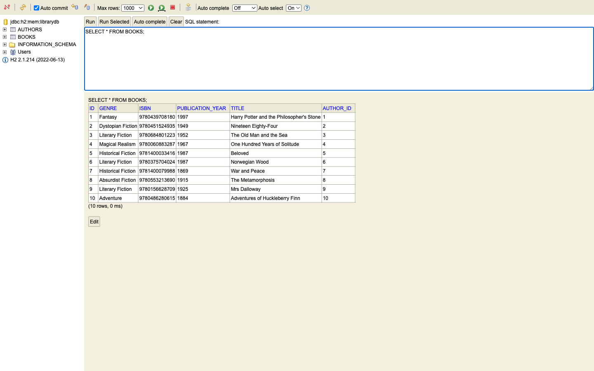

### 3.3 Create operation

The system uses JSP forms with Spring tag libraries. Validation is enforced using `@Valid` and `BindingResult`.

#### 📷 Screenshot 3 — Blank "Add New Author" form (`/authors/new`)

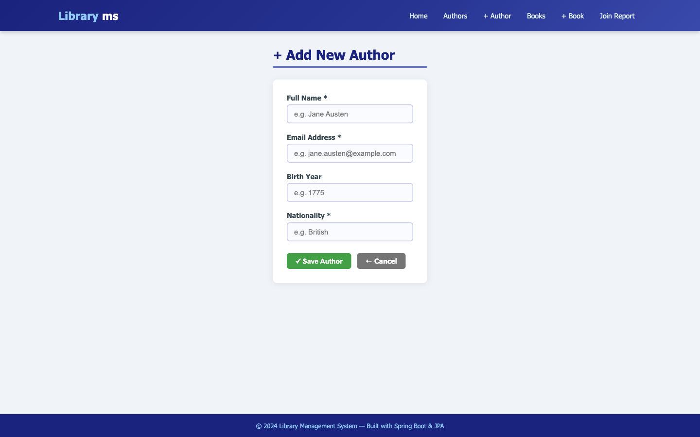

#### 📷 Screenshot 4 — Authors list with success message after adding "Fyodor Dostoevsky"

*Email `f.dostoevsky@example.com`, Birth Year 1821, Nationality Russian.*

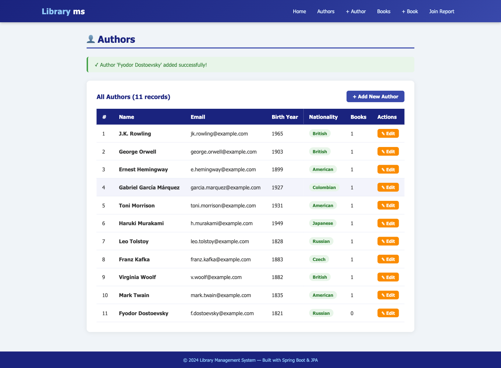

#### 📷 Screenshot 5 — Duplicate-email error

*"An author with email 'f.dostoevsky@example.com' already exists."*

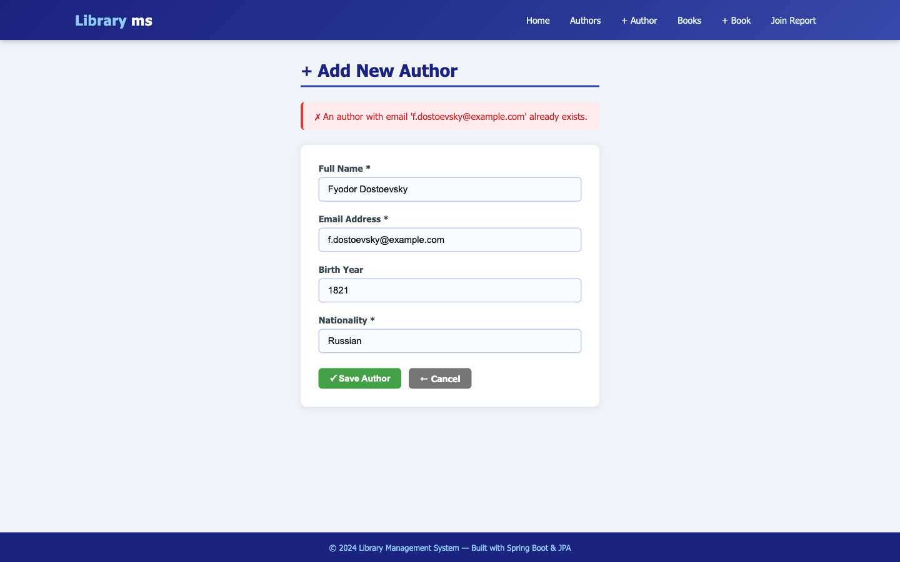

#### 📷 Screenshot 6 — "Add New Book" form (`/books/new`) including the Author dropdown

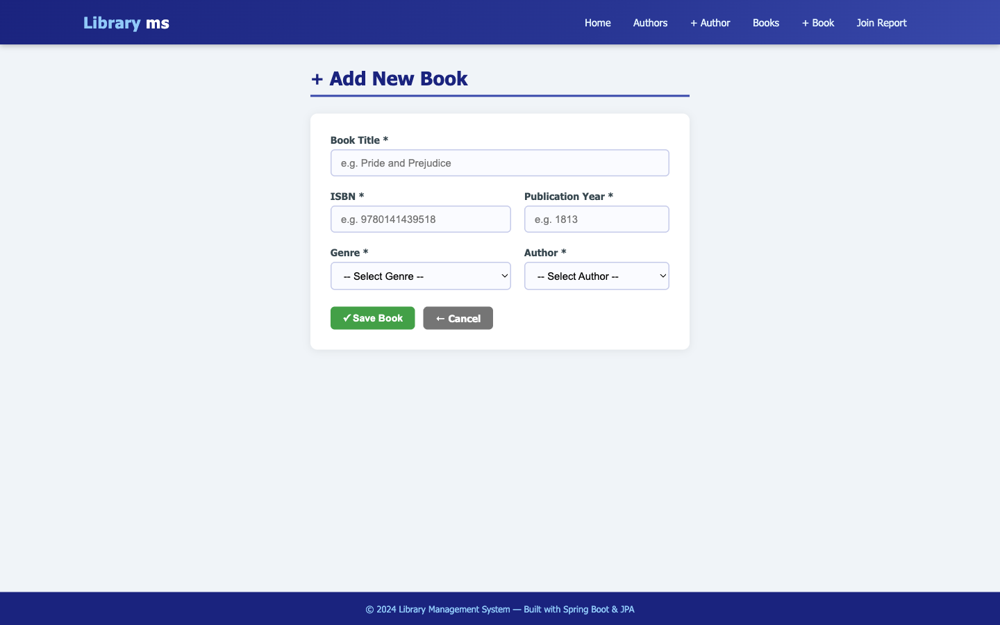

---

### 3.4 Read operation & JPQL join

The system fetches records into tabular views. A custom **inner join** is used for the comprehensive Library Report.

```java
@Query("SELECT new com.library.dto.BookWithAuthorDTO(b.id, b.title, b.isbn, b.publicationYear, b.genre, a.name, a.nationality) " +
       "FROM Book b INNER JOIN b.author a ORDER BY a.name, b.title")
List<BookWithAuthorDTO> findAllBooksWithAuthors();
```

#### 📷 Screenshot 7 — Authors list (`/authors`)

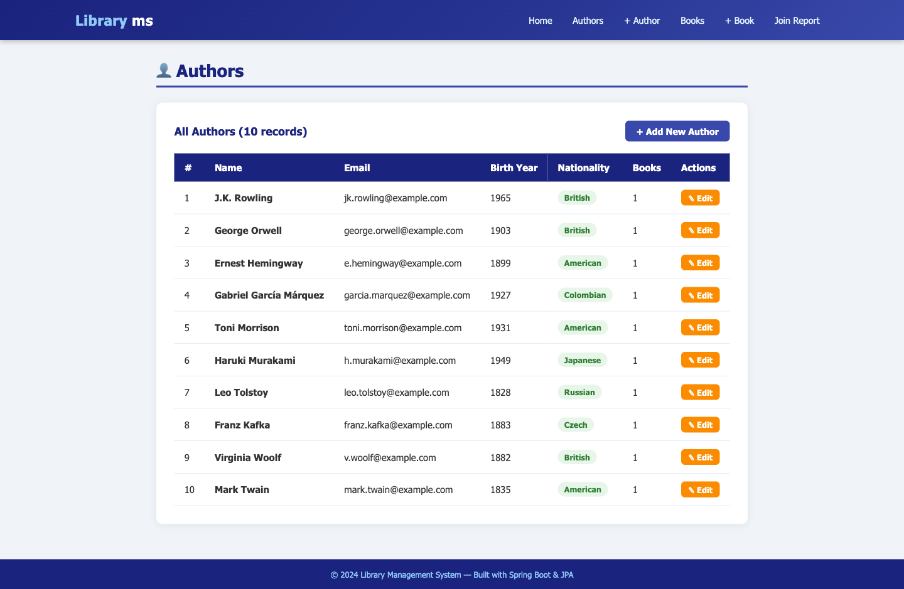

#### 📷 Screenshot 8 — Books list (`/books`)

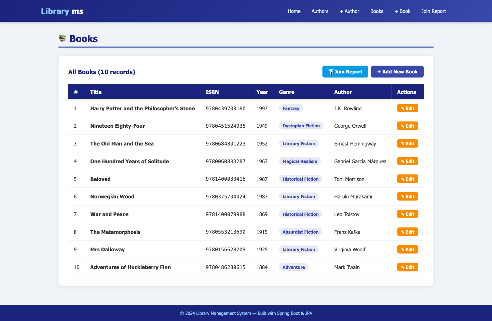

#### 📷 Screenshot 9 — Join Report (`/books/report`) with the JPQL query displayed at the bottom

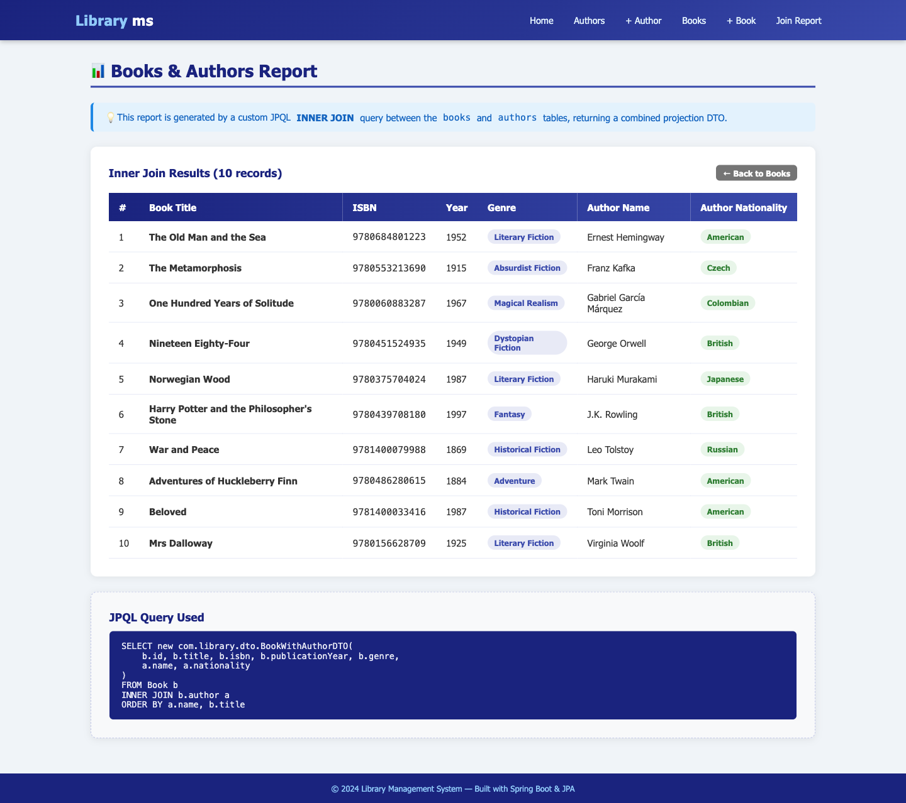

### 3.5 Update operation

Updating involves pre-filling a form via `@PathVariable` ID lookup and persisting changes through the Service layer.

#### 📷 Screenshot 10 — Edit Author form pre-filled

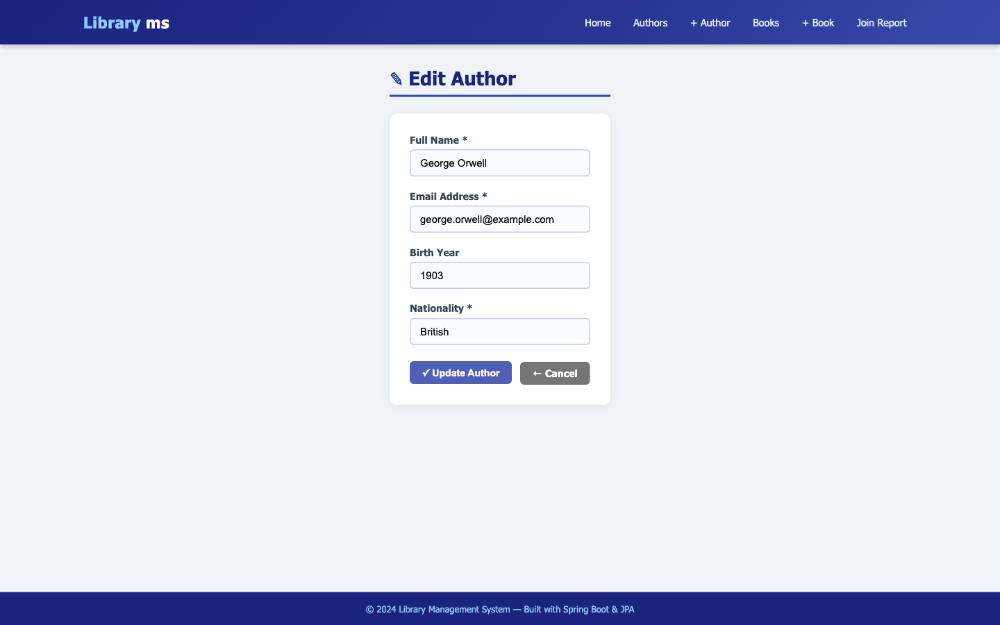

#### 📷 Screenshot 11 — Authors list after update (success message + updated value)

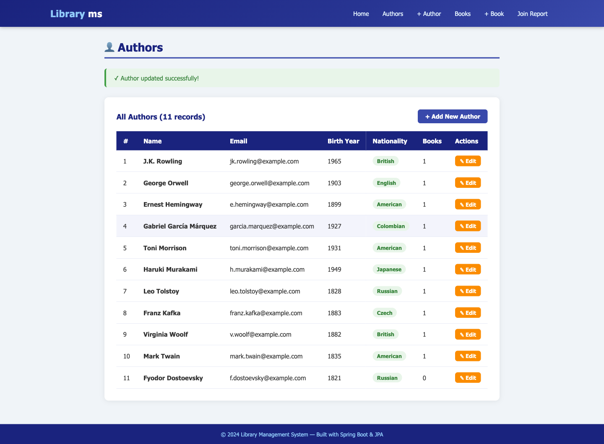

#### 📷 Screenshot 12 — Edit Book form pre-filled (Author dropdown pre-selected)

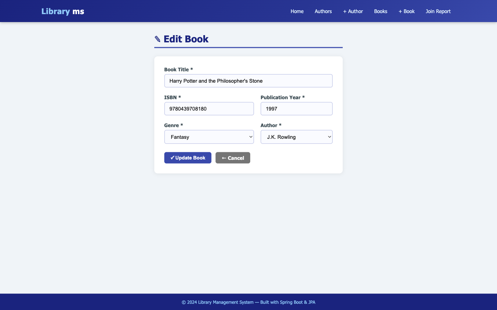

---

## SECTION 4 — Testing

Unit tests cover the Repository layer (using `@DataJpaTest`) and the Service layer (using Mockito).

- **Total tests:** 37
- **Result:** All passing ✅

| Suite                                  | Tests |
| -------------------------------------- | ----- |
| `com.library.repository.AuthorRepositoryTest` | 10    |
| `com.library.repository.BookRepositoryTest`   | 10    |
| `com.library.service.BookServiceTest`         | 9     |
| `com.library.service.AuthorServiceTest`       | 8     |
| **Total**                                     | **37** |

#### 📷 Screenshot 13 — `mvn test` output

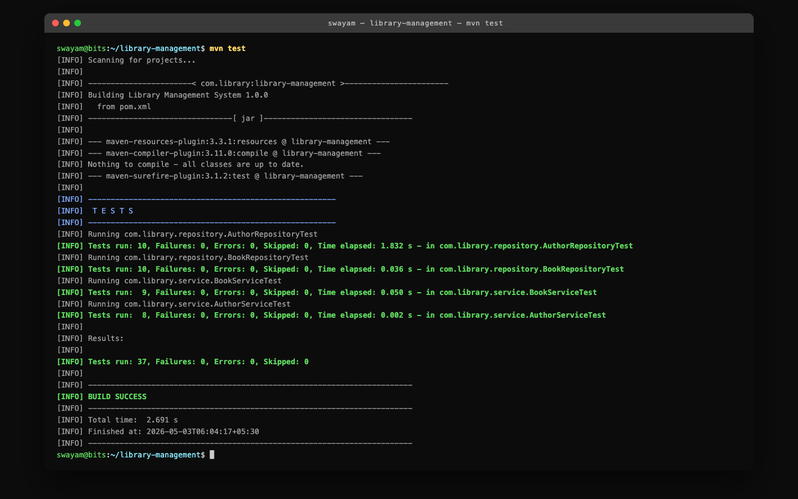

---

## SECTION 5 — Challenges & solutions

1. **JSP Rendering (404 Error)**
   - *Challenge:* Embedded Tomcat couldn't find the `webapp` folder when run as a WAR in the IDE.
   - *Solution:* Switched packaging to `JAR` and ensured `tomcat-embed-jasper` was in the default scope.
2. **DTO Constructor Mismatch**
   - *Challenge:* JPQL "new" expressions require exact parameter matching.
   - *Solution:* Aligned the `BookWithAuthorDTO` constructor precisely with the JPQL `SELECT` order.
3. **Dropdown Binding**
   - *Challenge:* Binding a plain ID from the UI to a nested Author object.
   - *Solution:* Used `@RequestParam` to capture the ID, then manually fetched and set the Author entity before saving the Book.

---

## SECTION 6 — Dashboard

#### 📷 Screenshot 14 — Library ms dashboard at `http://localhost:8081/`

The dashboard shows:
- The "Library ms" header with navigation links
- Two stat cards (Authors count | Books count) side by side
- A Quick Actions grid (3 cards on row 1, 2 on row 2)

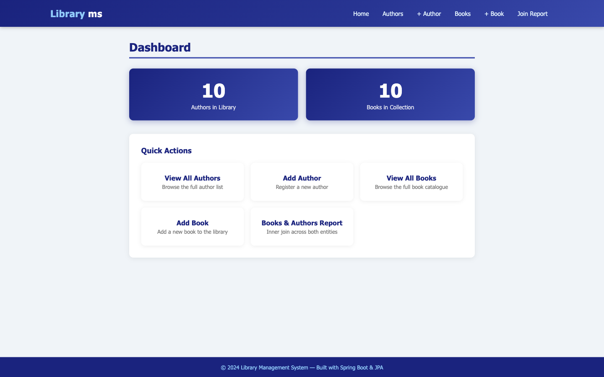

---

## SECTION 7 — GitHub repository

**URL:** <https://github.com/mohit-1710/spring-boot-library-management>

### Run locally

```bash
git clone https://github.com/mohit-1710/spring-boot-library-management.git
cd spring-boot-library-management/library-management
mvn spring-boot:run
```

Open <http://localhost:8081/>.

The H2 console is at <http://localhost:8081/h2-console> &middot; JDBC URL `jdbc:h2:mem:librarydb` &middot; user `sa` &middot; no password.

### Run the tests

```bash
cd library-management
mvn test
```

---

<div align="center">
<sub>Built with ☕ Java 17, 🌿 Spring Boot 2.7, and 🛢️ H2.</sub>
</div>
